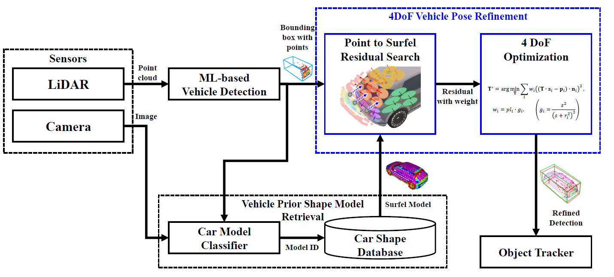
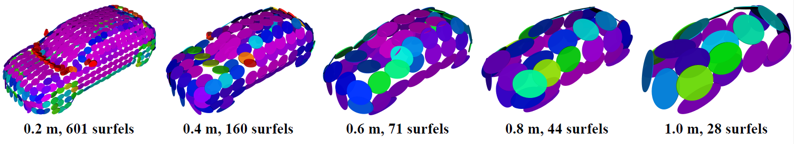
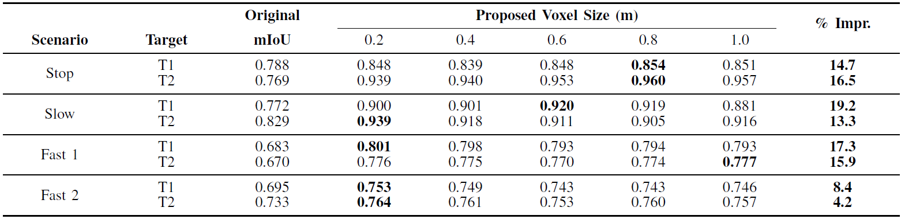
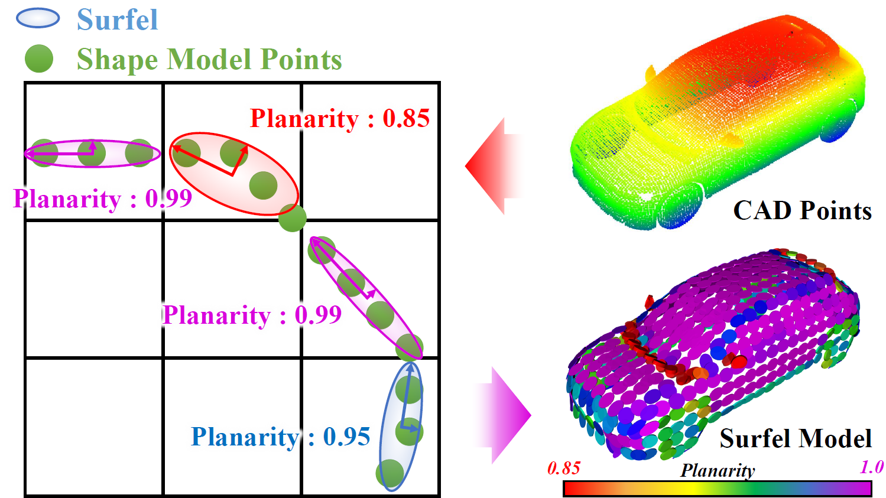
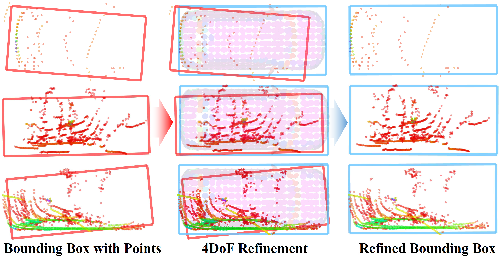

📌 **This paper has been accepted for publication in IEEE Robotics and Automation Letters (RA-L), 2025.**

# Accurate Pose Refinement of Detected Vehicles Using LiDAR Point-to-Surfel ICP and Vehicle Shape Priors
Repository for paper "*Accurate Pose Refinement of Detected Vehicles Using LiDAR Point-to-Surfel ICP and Vehicle Shape Priors*"

This repository provides code of prior model-based detection refinement module.

<div align="center">

<br />
<b>System architecture</b>
</div>
<br>

<div align="center">


<br />
<b>Detection improvement (mIoU) results by various voxel size</b>
</div>
<br>

## Method

1. Downsample vehicle prior model into **Surfel Model**

<div align="center">

<br />
<b>Downsampling CAD model to Surfel model</b>
</div>
<br>
<!--  -->


2. Execute 4-DoF Point-to-Surfel registration.
<div align="center">

<br />
<b>Refinement process</b>
</div>
<br>

## Demo
* Stop Scenario Comparision
<div align="center">

<br />
<b>(Left) Tracking without refinement : Due to unstable detection, static objects become dynamic   
(Right) Tracking with refinement : Static due to stable detection</b>
</div>
<br>

## 📦 Prerequisites & Installation

### Dependencies
This project depends on standard ROS packages and PCL.
* **ROS 1** (Noetic recommended)
* **PCL** (Point Cloud Library)
* **JSK Recognition Msgs** (For bounding box interface)
  ```bash
  sudo apt-get install ros-noetic-jsk-recognition-msgs
  sudo apt-get install ros-noetic-jsk-rviz-plugins
  ```

### Sample Bag File
Download in **[Download Link](https://ailab2.synology.me:5001/sharing/Co0hsfNc4)**

## Build
```bash
cd ~/catkin_ws/src
git clone https://github.com/ailab-hanyang/CAD_Refinement
catkin_make
source devel/setup.bash
```

## 🏃Run Algorithm
### 1. Execution
```bash
# 1. Run your Object Detector (Output must be jsk_recognition_msgs/BoundingBoxArray)
# ...
# 2. Run CAD Registration Node
roslaunch cad_registration cad_registration.launch
```

### 2. Input / Output Topics
- Input:
    - LiDAR Point Cloud ```(sensor_msgs/PointCloud2)```
    - Detected Objects ```(jsk_recognition_msgs/BoundingBoxArray)```

- Output:
    - Refined Objects ```(jsk_recognition_msgs/BoundingBoxArray)``` : ```app/perc/jsk_refined_objects```
    - Refined Point Cloud ```(sensor_msgs/PointCloud2)``` : ```app/perc/refined_cad_pc_```
    - Surfel Visualization ```(visualization_msgs/MarkerArray)``` : ```ego_surfel```

## 📝 Citation

If you find this work useful in your research, please cite:

```bibtex
@article{kim2025accurate,
  title={Accurate Pose Refinement of Detected Vehicles Using LiDAR Point-to-Surfel ICP and Vehicle Shape Priors},
  author={Kim, Soyeong and Jo, Jaeyoung and Lee, Jaehwan and Jo, Kichun},
  journal={IEEE Robotics and Automation Letters},
  year={2025},
  publisher={IEEE}
}
```

## 📧 Contact
If you have any questions, please let me know:
- Soyeong Kim (`soyeongkim@hanyang.ac.kr`), Jaeyoung Jo (`wodud3743@gmail.com`), Jaehwan Lee
- AILAB Hanyang University (https://autolab.hanyang.ac.kr/)