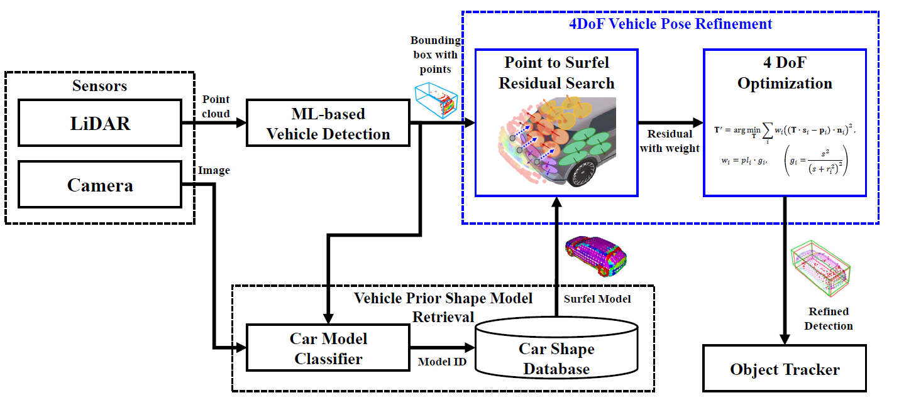
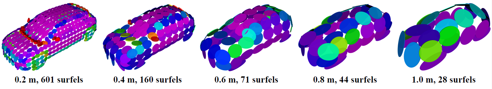
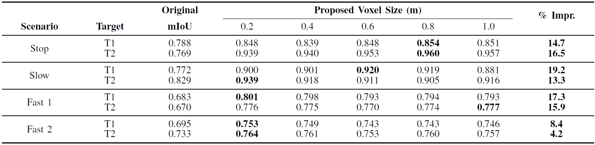
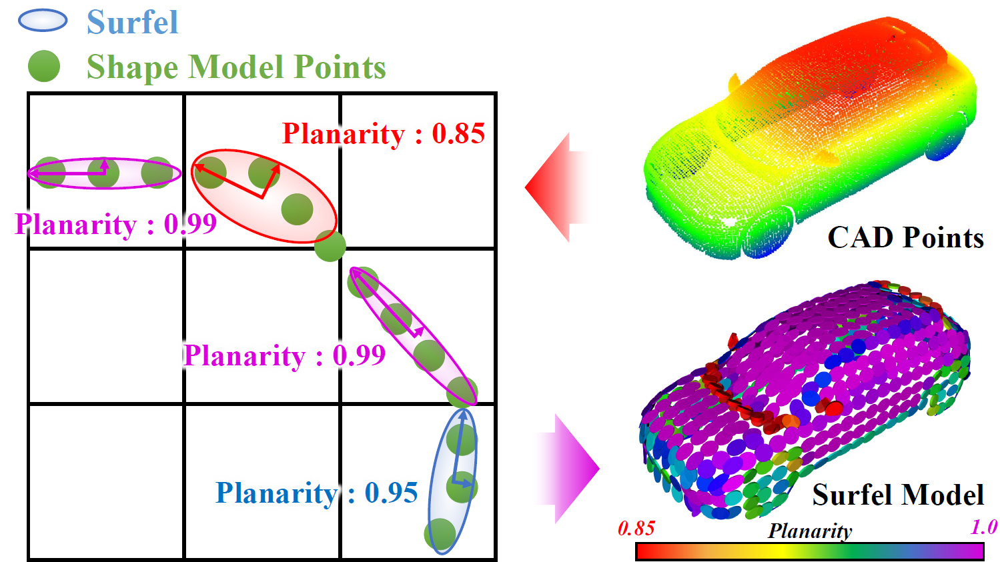
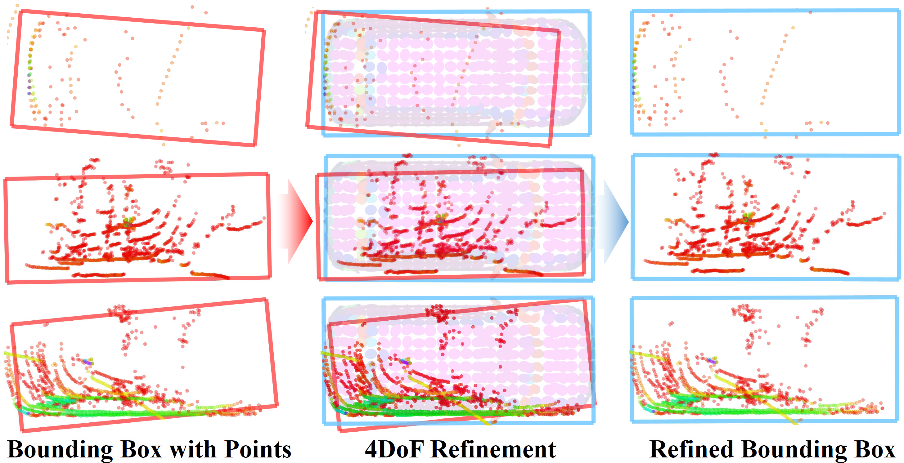
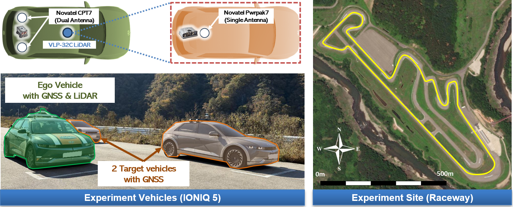
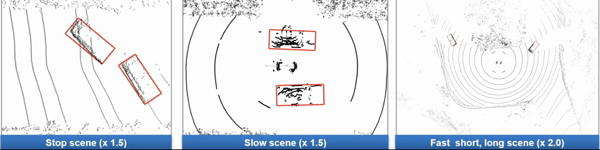

📌 **This paper has been accepted for publication in IEEE Robotics and Automation Letters (RA-L), 2024.**

# Accurate Pose Refinement of Detected Vehicles Using LiDAR Point-to-Surfel ICP and Vehicle Shape Priors
Repository for paper "*Accurate Pose Refinement of Detected Vehicles Using LiDAR Point-to-Surfel ICP and Vehicle Shape Priors*"

This repository provides code of prior model-based detection refinement moudle, dataset and evaluation tool  
(Our codes will be provided soon. Stay tuned!)

<div align="center">

<br />
<b>System architecture</b>
</div>
<br>

<div align="center">


<br />
<b>Detection improvement (mIoU) results by various voxel size</b>
</div>
<br>

## Method

1. Downsample vehicle prior model into **Surfel Model**

<div align="center">

<br />
<b>Downsampling CAD model to Surfel model</b>
</div>
<br>
<!--  -->


2. Execute 4-DoF Point-to-Surfel registration.
<div align="center">

<br />
<b>Refinement process</b>
</div>
<br>

## Demo
* Stop Scenario Comparision
<div align="center">

<br />
<b>(Left) Tracking without refinement : Due to unstable detection, static objects become dynamic   
(Right) Tracking with refinement : Static due to stable detection</b>
</div>
<br>


## Run Algorithm
1. Detection only
```
roslaunch box_point_generator box_point_generator.launch
roslaunch cad_registration cad_registration.launch
```

2. Run Tracking (TBD)

# Evaluation


## Evaluation Setup & Sensors
- LiDAR : Velodyne VLP-32C   
- GNSS : Novtel CPT-7, Novatel Pwrpak7

<div align="center">

<br />
<b>Evaluation setup and test track</b>
</div>
<br>

## Scenario Example
<div align="center">

<br />
<b>4 scenarios</b>
</div>
<br>

1. Stop Scenario (18.3 sec): Target vehicles static. Ego vehicle moves slowly.
2. Slow Scenario (30.0 sec): The target vehicles and the ego vehicle move slowly in parallel.
3. Fast Scenario short (159 sec) : Target vehicles and ego vehicles drive at high speed, overtaking each other
4. Fast Scenario long (399 sec) : Target vehicles and ego vehicles drive at high speed, overtaking each other

## Scenario Bag file

[Google Drive Link] will be provided soon. Stay tuned!
1. Stop Scenario
    1. Ego: /Ego_Vehicle/stop_3_ego.bag
    2. Target 1: /Target_Vehicle_1/target_1_3.bag
    3. Target 2: /Target_Vehicle_2/target_2_3.bag
2. Slow Scenario
    1. Ego: /Ego_Vehicle/slow_0_ego.bag
    2. Target 1: /Target_Vehicle_1/target_1_0.bag
    3. Target 2: /Target_Vehicle_2/target_2_0.bag
3. Fast Scenario short
    1. Ego: /Ego_Vehicle/fast_3_short_ego.bag
    2. Target 1: /Target_Vehicle_2/target_1_3.bag
    3. Target 2: /Target_Vehicle_2/target_2_3.bag
4. Fast Scenario long
    1. Ego: /Ego_Vehicle/fast_2_long_ego.bag
    2. Target 1: /Target_Vehicle_2/target_1_2.bag
    3. Target 2: /Target_Vehicle_2/target_2_2.bag

### Data Preparation

1. Need GNSS Topic from target vehicle (Existed in bag files)
* /novatel/oem7/inspvax

2. Ego detection topoic type should be "**autohyu_msgs::DetectsObjects**" (Will be change to a general topic type.)
* topic_name/ego_detection_topic_name


## Run Evaluation Tool
0. Setup system.yaml file
1. Launch Evaluation tool
```
roslaunch detection_evaluation detection_evaluation.launch
```
2. rviz file in /rviz/autoku_evaluation.rviz

3. Type scene number when "*Enter index of scene to visualize ('q' to quit)*" pop up

## Citation

If you find this work useful in your research, please cite:

```bibtex
@article{kim2025accurate,
  title={Accurate Pose Refinement of Detected Vehicles Using LiDAR Point-to-Surfel ICP and Vehicle Shape Priors},
  author={Kim, Soyeong and Jo, Jaeyoung and Lee, Jaehwan and Jo, Kichun},
  journal={IEEE Robotics and Automation Letters},
  year={2025},
  publisher={IEEE}
}
```

## Contact
If you have any questions, please let me know:
- Soyeong Kim (`soyeongkim@hanyang.ac.kr`), Jaeyoung Jo (`wodud3743@gmail.com`)
- AILAB Hanyang University (https://autolab.hanyang.ac.kr/)